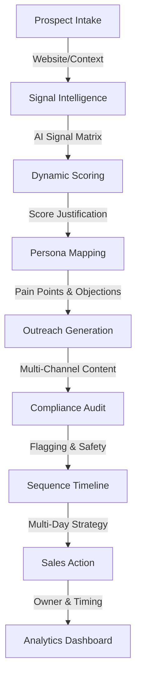

# Blostem AI — System Architecture

Blostem AI is built as a modular "Intelligence Engine" that transforms raw market data into high-converting sales outreach.

## 🏗️ High-Level Overview

The system follows a directed acyclic graph (DAG) flow where each stage enriches the prospect data with AI-driven insights.

## 🧩 Core Modules

### 1. Prospect Intake
- **Input**: Company Name + Optional Website/Notes.
- **Support**: CSV Bulk Upload & Manual Entry.

### 2. Signal Intelligence (Gemini Pro)
- AI-driven extraction of market signals.
- Identifies hiring trends, funding news, and technology stack indicators.

### 3. Dynamic Scoring & Justification
- Calculates **Fit**, **Intent**, and **Confidence**.
- Generates a human-readable **Score Justification** to provide transparency to sales reps.

### 4. Persona Mapping
- Identifies **5 distinct personas** per account.
- Maps specific pain points, likely objections, and pitch angles for each role.

### 5. Outreach Generation
- Generates 5 message types: Initial Email, Follow-up, LinkedIn, Call Script, and Sales Note.
- Injects prospect-specific signals into every message.

### 6. Compliance Guardrails
- Scans outreach for false claims or regulatory overstatements.
- Returns status: `APPROVED`, `NEEDS_REVISION`, or `FLAGGED`.

### 7. Sequence Builder & Timeline
- Orchestrates multi-day outreach schedules.
- Visual timeline with interactive "Send Now" and "Sent" states.

### 8. Sales Action Recommendation
- Final step that recommends the best owner (AE vs SDR) and timing for the account.

## 📊 Analytics Module
- Aggregates pipeline data into high-level metrics.
- Visualizes conversion funnels and approval rates using Recharts.
