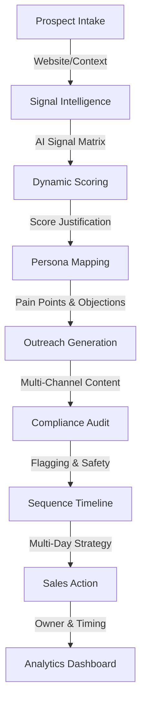

# 🌿 Blostem AI

**Hyper-Personalized Fintech Marketing Automation MVP**

Blostem AI is an end-to-end intelligence platform designed to automate the complex outreach workflows for Fintech and Financial Services. It leverages Google Gemini AI to analyze market signals, score leads with transparency, and generate multi-touch outreach sequences that are compliant and persona-specific.

## 🚀 The 8-Stage Pipeline

Blostem AI orchestrates a sophisticated data pipeline that transforms a simple company name into a fully actionable, multi-day sales strategy.

## 🛠️ Tech Stack

- **Frontend**: Next.js (App Router), React, TypeScript, TailwindCSS, Lucide React, Recharts, Sonner.
- **Backend**: FastAPI (Python), SQLite (SQLAlchemy).
- **AI Engine**: Google GenAI (Gemini) with multi-key rotation + Ollama fallback (optional).

## ✨ Key Features

- **Signal Intelligence**: Deep-dive analysis of company news, hiring patterns, and product launches.
- **Transparent Scoring**: No "black box" scores. Every lead comes with a detailed AI justification explaining the Fit and Intent.
- **5-Persona Coverage**: Automatically maps the top 5 decision-makers (e.g., CTO, VP Compliance, Head of Growth).
- **Multi-Touch Sequences**: 5-step outreach plans including Initial Email, LinkedIn Notes, and Call Scripts.
- **Compliance Guardrails**: Automatic flagging of false claims or regulatory overstatements in AI-generated messages.
- **Actionable Analytics**: Convert pipeline data into conversion funnels and approval metrics.

## 🏁 Getting Started

### Backend Setup
1. `cd "main project/blostem-backend"`
2. `pip install -r requirements.txt`
3. Set one or more Gemini keys in environment variables:
   - `GEMINI_API_KEY_1` (required to use Gemini)
   - `GEMINI_API_KEY_2`, `GEMINI_API_KEY_3`, `GEMINI_API_KEY_4` (optional rotation/fallback)
   - If no Gemini keys are set, the backend will attempt to fall back to local Ollama at `http://localhost:11434`.
4. `uvicorn main:app --reload`

### Frontend Setup
1. `cd "main project/blostem-ui"`
2. `npm install`
3. `npm run dev`

---
*Developed for the Blostem AI MVP.*
