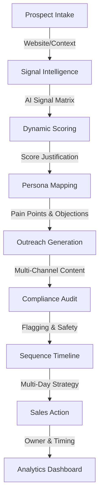

# 🌿 Blostem AI

**Hyper-Personalized Fintech Marketing Automation Platform**

Blostem AI is an end-to-end intelligence platform designed to automate complex outreach workflows for Fintech and Financial Services. It leverages Google Gemini AI to analyze market signals, score leads with transparency, and generate multi-touch outreach sequences that are compliant and persona-specific.

## 🚀 The 8-Stage Pipeline

Blostem AI orchestrates a sophisticated data pipeline that transforms a simple company name into a fully actionable, multi-day sales strategy.

## 🛠️ Tech Stack

- **Frontend**: Next.js 16 (App Router), React 19, TypeScript, TailwindCSS 4, Lucide React, Recharts, Sonner.
- **Backend**: FastAPI (Python 3.13), SQLAlchemy (PostgreSQL/Supabase).
- **AI Engine**: Google GenAI (Gemini) with **multi-key rotation**, **exponential backoff (2s, 4s, 8s)**, and **local Ollama fallback** for mission-critical reliability.

## ✨ Key Features

- **Signal Intelligence**: Deep-dive analysis of company news, hiring patterns, and product launches.
- **Production Resilience**: A self-healing AI layer featuring:
  - **Exponential Backoff**: Automatic retries (2s, 4s, 8s) for transient 429/500 errors.
  - **Multi-Engine Rotation**: Seamlessly switches between 4x Gemini API keys.
  - **Groq High-Speed Fallback**: Automatically activates a Groq (Llama 3.3) backup if Gemini is exhausted.
  - **Graceful Failure**: Returns safe "Mock" JSON if all cloud services are down, keeping the UI functional.
  - **Local Ollama Support**: Optional on-premise fallback for high-security or offline environments.
- **5-Persona Coverage**: Automatically maps the top 5 decision-makers (e.g., CTO, VP Compliance, Head of Growth).
- **Multi-Touch Sequences**: 5-step outreach plans including Initial Email, LinkedIn Notes, and Call Scripts.
- **Compliance Guardrails**: Automatic flagging of false claims or regulatory overstatements in AI-generated messages.
- **Actionable Analytics**: Convert pipeline data into conversion funnels and approval metrics.

## 🏁 Getting Started

### Backend Setup
1. `cd app-core/blostem-backend`
2. `pip install -r requirements.txt`
3. Configure your `.env` file (refer to `.env.example`) with:
   - `DATABASE_URL`: Your Supabase/PostgreSQL connection string.
   - `GEMINI_API_KEY_1` to `GEMINI_API_KEY_4`: Multiple keys for rotation.
   - `GROQ_API_KEY`: High-speed cloud fallback key.
   - `ENABLE_OLLAMA_FALLBACK`: Set to 'true' if running a local model as backup.
   - `SUPABASE_JWT_SECRET`: For authenticated requests.
4. `uvicorn main:app --reload`

### Frontend Setup
1. `cd app-core/blostem-ui`
2. `npm install`
3. Configure `NEXT_PUBLIC_BACKEND_URL` in your `.env.local`.
4. `npm run dev`

---
*Developed for the Blostem AI MVP.*
