# 🌿 Blostem AI

### *Hyper-Personalized Fintech Sales Enrichment & Marketing Automation Platform*

[](https://fastapi.tiangolo.com)
[](https://nextjs.org)
[](https://react.dev)
[](https://tailwindcss.com)
[](https://deepmind.google/technologies/gemini)
[](https://build.nvidia.com)
[](https://postgresql.org)

Blostem AI is an end-to-end intelligence engine designed to automate complex, highly regulated outreach workflows for Fintech and Financial Services. By leveraging the advanced **NVIDIA NIM API** (powered by the **Nemotron-3 Super 120B** reasoning model) as its primary engine, backed by live Google Search retrieval and multi-layered cloud fallbacks, it processes raw target accounts, extracts hiring/funding/product signals, dynamically scores them with full transparency, maps decision-makers, and drafts audit-proof outreach sequences.

---

## 🚀 The 8-Stage Intelligence Pipeline

Blostem AI operates as a structured, directed acyclic graph (DAG) data pipeline. A single company website or profile flows sequentially through 8 intelligence modules:

```mermaid
graph TD
    A[1. Intake Protocol] -->|CSV / Manual Context| B[2. Signal Intelligence]
    B -->|Search-Backed Signals| C[3. Dynamic Scoring]
    C -->|Transparency & Weights| D[4. Persona Mapping]
    D -->|Pain Points & Objections| E[5. Outreach Generation]
    E -->|Multi-Channel Content| F[6. Compliance Guardrails]
    F -->|Flagging & Tone Check| G[7. Sequence Timeline]
    G -->|Multi-Day Outbox Schedule| H[8. Action Recommendation]
    H -->|Owner SDR/AE & Timing| I[Analytics Dashboard]
    style A fill:#1e293b,stroke:#3b82f6,stroke-width:2px;
    style B fill:#1e293b,stroke:#8b5cf6,stroke-width:2px;
    style C fill:#1e293b,stroke:#8b5cf6,stroke-width:2px;
    style D fill:#1e293b,stroke:#8b5cf6,stroke-width:2px;
    style E fill:#1e293b,stroke:#06b6d4,stroke-width:2px;
    style F fill:#1e293b,stroke:#06b6d4,stroke-width:2px;
    style G fill:#1e293b,stroke:#06b6d4,stroke-width:2px;
    style H fill:#1e293b,stroke:#10b981,stroke-width:2px;
    style I fill:#0f172a,stroke:#334155,stroke-width:1px;
```



1. **Intake Protocol**: Bulk ingest prospects via standard CSV spreadsheet uploads or input manually with custom company contexts.
2. **Signal Intelligence**: Queries the primary reasoning engine (NVIDIA NIM / fallback models) to fetch fresh hiring patterns, funding news, active technology stacks, and operational pain points.
3. **Dynamic Scoring**: Computes mathematical sub-scores across five parameters (Fintech Relevance, Growth Signals, Product Fit, Hiring Activity, Recency) using a weighted algorithm to construct Fit, Intent, Priority, and Confidence metrics.
4. **Persona Mapping**: Generates exactly 5 distinct decision-maker personas per prospect (Founder/CEO, VP Product, Head of Partnerships, VP Growth, VP Compliance), detailing their role-specific pain points, likely objections, and custom pitch angles.
5. **Outreach Generation**: Generates 5 high-converting message formats per persona: Initial Email, Follow-up Email, LinkedIn InMail, Cold Call Script, and internal operator briefing notes.
6. **Compliance Guardrails**: Automatically audits drafted sequences to flag false claims, regulatory overstatements, or aggressive messaging, assigning a safety score and overall status (`APPROVED` / `NEEDS_REVISION` / `FLAGGED`).
7. **Sequence Timeline**: Maps outreach steps onto an interactive multi-day schedule (e.g., Days 1, 3, 7, 14), tracking approval states.
8. **Action Recommendation**: Prescribes a final strategic recommendation: defining the high-priority actions, optimal reach-out timing (e.g., within 48 hours), and ideal sequence owner (SDR vs. AE).

---

## 🛠️ Technological Architecture

### Frontend Layer (`app-core/blostem-ui`)
- **Framework**: **Next.js 16 (App Router)** utilizing **Turbopack** for instantaneous local compilation.
- **Rendering Engine**: **React 19** incorporating Concurrent Features and custom hooks.
- **Styling & UI**: Tailwind CSS v4 coupled with Lucide React, glassmorphism card shaders, and dynamic visual state variables.
- **Interactive Visualizations**: High-fidelity pipeline and compliance charts powered by **Recharts**.
- **Animations**: Fluid micro-animations and interface states utilizing **Framer Motion**.
- **State & Routing**: Unified URL-driven selection system via dynamic routers and customized middlewares.

### Backend Layer (`app-core/blostem-backend`)
- **Engine**: **FastAPI** (Python 3.13) for lightning-fast concurrent request handling.
- **ORM / Database**: **SQLAlchemy 2.0** featuring self-healing migration mechanisms that automatically create tables and safely map newly appended columns on startup.
- **Databases Supported**: Local file-based **SQLite** (out-of-the-box offline development) and production-ready **PostgreSQL / Supabase**.

### AI & Production Resilience Layer
- **Primary AI Engine**: **NVIDIA NIM API** running the state-of-the-art **Nemotron-3 Super 120B** (`nvidia/nemotron-3-super-120b-a12b`) reasoning model. Features thinking parameters (`enable_thinking: True`) and an extended reasoning budget parameter configuration (`reasoning_budget: 16384`) for high-fidelity fintech synthesis.
- **Secondary AI / Fallback**: **Gemini 2.0 Flash** for maximum fallback speed and schema-enforced JSON outputs.
- **Multi-Key Rotation**: Built-in support to cycle across up to four independent Gemini API keys on quota exhaustion or 429/quota limits.
- **Groq Fallback**: Seamless, high-speed failover to Groq Cloud (**Llama 3.3 70B**) if Gemini keys are unreachable.
- **Local Ollama Fallback**: Optional, offline-first fallback utilizing a local Ollama instance (configured with Gemma/Llama).
- **Graceful Mock Failure**: Automatically falls back to safe mock JSON models to maintain UI functionality if all external cloud and local systems are unavailable.

---

## 🔌 API Route Architecture

FastAPI exposes highly structured endpoints grouped by resources. All prospect operations are isolated by user ID via Supabase JWT middleware:

| Method | Endpoint | Description | Auth Required |
| :--- | :--- | :--- | :--- |
| **GET** | `/prospects/` | List all user prospects sorted by priority score | Yes |
| **POST** | `/prospects/` | Manually ingest a single prospect | Yes |
| **POST** | `/prospects/upload/` | Ingest prospects in bulk using a styled CSV upload | Yes |
| **DELETE**| `/prospects/{id}` | Purge a prospect and cascading outreach events | Yes |
| **POST** | `/prospects/batch-delete`| Purge multiple prospects in a single transaction | Yes |
| **POST** | `/prospects/{id}/generate-signals` | Trigger Consolidated Intelligence Pipeline (Signals + Scoring + Personas) | Yes |
| **POST** | `/prospects/{id}/generate-outreach` | Trigger Consolidated Execution Pipeline (Outreach + Compliance + Next Action) | Yes |
| **POST** | `/prospects/{id}/approve` | Toggle approval status and compile multi-day timeline | Yes |
| **GET** | `/prospects/analytics` | Fetch aggregated dashboard analytics metrics | Yes |
| **GET** | `/prospects/export` | Download a beautifully styled spreadsheet (`XLSX`) of approved sequences | Yes |
| **GET** | `/prospects/export-csv` | Download a flat, flat-column `CSV` file for CRM import | Yes |
| **GET** | `/prospects/export-json` | Download raw JSON structured pipeline data | Yes |

---

## 🏁 Quick Start: Run Locally in Minutes

Blostem AI is equipped with an **instant local developer bypass**. You can run the entire platform locally, offline, and completely free of charge using SQLite and a developer token fallback!

### Prerequisites
Make sure you have **Node.js** (v18+) and **Python** (v3.11+) installed on your machine.

### 1. Backend Setup
1. Navigate to the backend directory:
   ```bash
   cd app-core/blostem-backend
   ```
2. Install the Python requirements:
   ```bash
   pip install -r requirements.txt
   ```
3. Setup your `.env` configuration. You can copy the example file:
   ```bash
   cp .env.example .env
   ```
   *Note: For immediate local development, the `DATABASE_URL` is configured to fall back automatically to SQLite (`sqlite:///./blostem.db`).*
4. Run the FastAPI server:
   ```bash
   python -m uvicorn main:app --reload
   ```
   The backend will instantly initialize the SQLite database file and start listening on `http://127.0.0.1:8000`.

### 2. Frontend Setup
1. Navigate to the frontend UI directory:
   ```bash
   cd ../blostem-ui
   ```
2. Install the Node modules:
   ```bash
   npm install
   ```
3. Run the Next.js development server:
   ```bash
   npm run dev
   ```
4. Access the application:
   Open your browser and navigate to **[http://localhost:3000](http://localhost:3000)**! 

---

## ⚙️ Production Deployment Config

To deploy Blostem AI to production (e.g. Vercel for UI, Render/Railway for backend), complete the following configurations:

### Backend Environment Variables (`.env`)
- `DATABASE_URL`: Set to your production PostgreSQL connection string (e.g. Supabase, RDS).
- `SUPABASE_JWT_SECRET`: The JWT secret key from your Supabase auth dashboard, used to verify ES256/HS256 tokens.
- `NVIDIA_API_KEY`: Your NVIDIA NIM developer API key for the primary reasoning engine.
- `NVIDIA_MODEL`: Model ID to utilize (defaults to `nvidia/nemotron-3-super-120b-a12b`).
- `GEMINI_API_KEY_1` to `GEMINI_API_KEY_4`: Your fallback Google Gemini developer API keys for key-rotation and quota handling.
- `GROQ_API_KEY`: High-speed cloud backup key (Llama 3.3 fallback).

### Frontend Environment Variables (`.env.local` / Vercel Settings)
- `NEXT_PUBLIC_BACKEND_URL`: Set to your live FastAPI deployment URL (e.g. `https://api.yourdomain.com`).
- `NEXT_PUBLIC_SUPABASE_URL`: Your production Supabase project API endpoint.
- `NEXT_PUBLIC_SUPABASE_ANON_KEY`: Your production Supabase anonymous client API key.

---
*Developed as a high-fidelity intelligence platform MVP for Next-Gen Sales Operations.*
